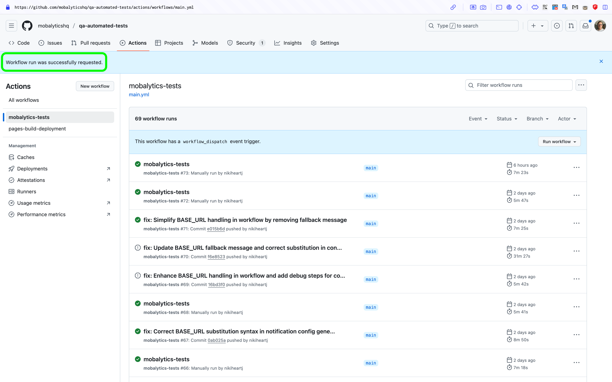
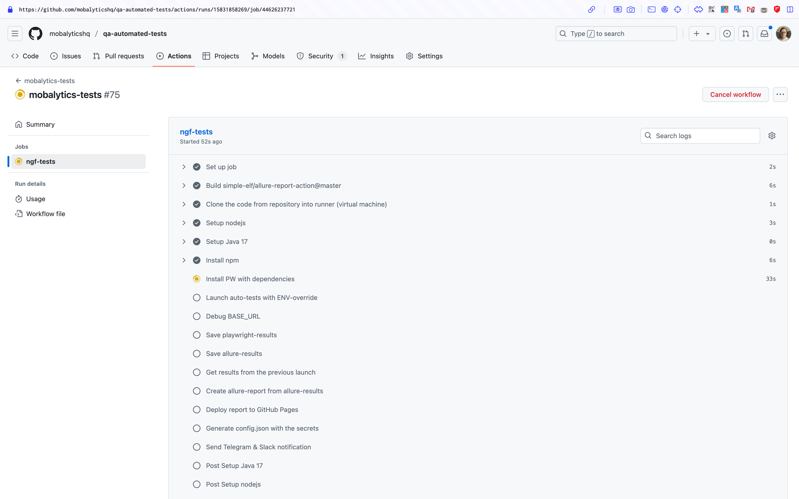
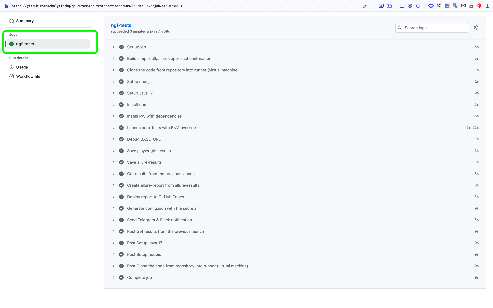
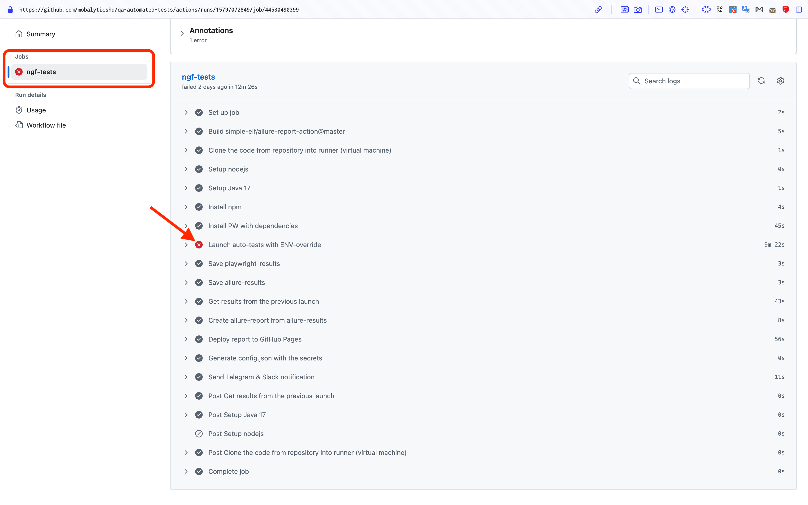
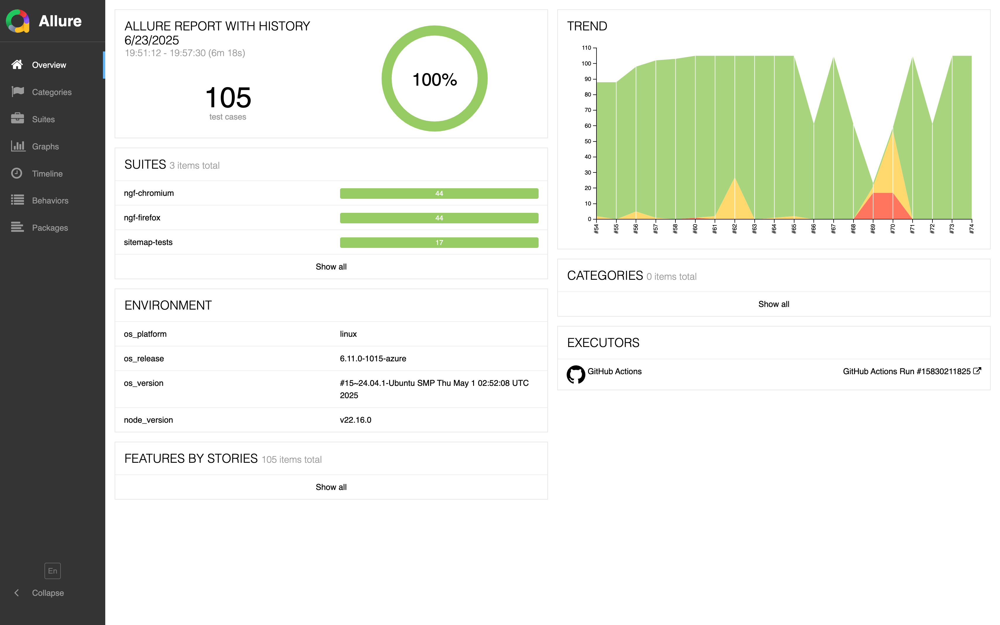
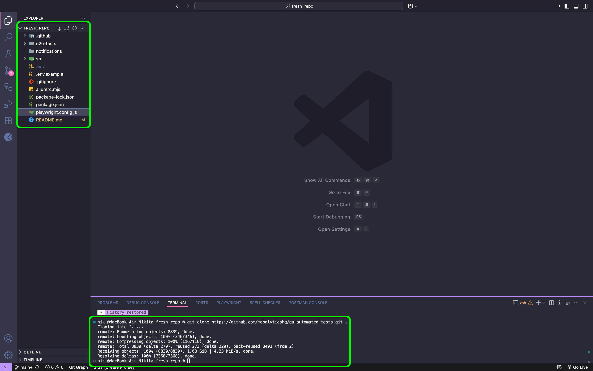
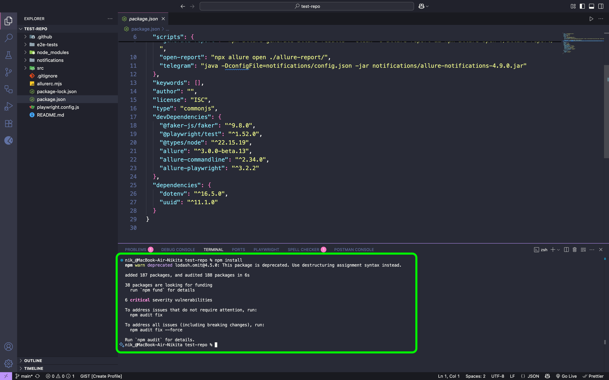
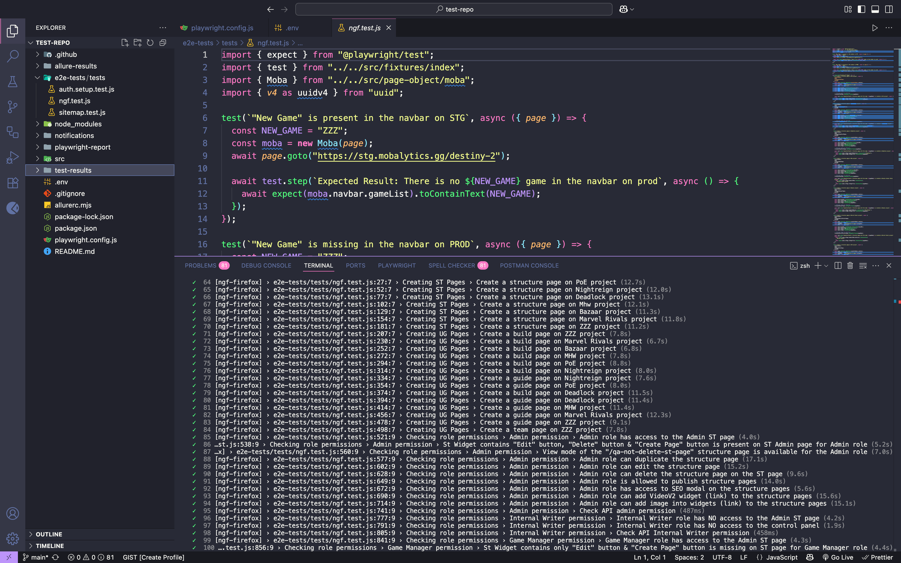
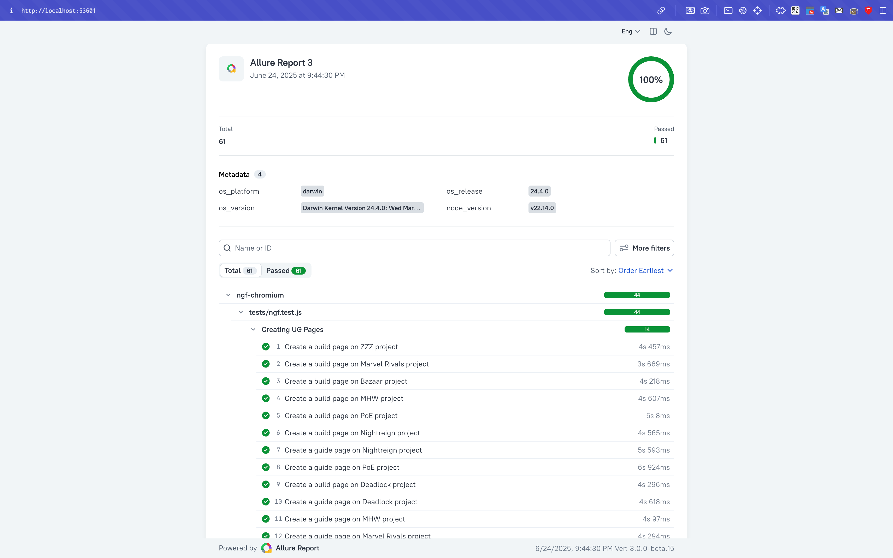
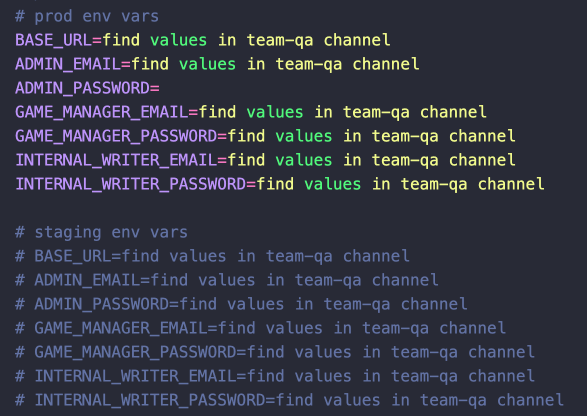

# Instruction on How to Launch Automated Tests

### Introduction

Hey, folks! There are two ways to launch tests:

- Using GitHub Actions (CI/CD)
- On your local machine (PC)

## Steps to Run Tests Using GitHub Actions

1. Go to the **Actions** tab _(all workflows are located here)_.

2. Select the **mobalytics-tests** workflow from the Actions sidebar on the left side of the screen.

3. Click the **Run workflow** button above the workflows list.

4. Select environment: PROD or STG in the dropdown. Then click the green **Run workflow** button.

   > You will see a message indicating "Workflow run was successfully requested."
   > 

5. Refresh the page and navigate to the running workflow _(a yellow circle indicates the workflow is running)_.

6. Click on the running job: **ngf-tests**.

   > You will see each step of the running job in progress.

   

Once the job is completed, you will receive one of two results:

- A green checkmark ✅ means all tests passed successfully.

  

- A red cross ❌ means some tests failed or are broken.

  

### Steps to Access the Allure Report

1. Return to the **Actions** tab.

2. Wait until the **pages build and deployment** workflow completes to generate the Allure Report _(a yellow circle means the workflow is running)_. If the workflow has completed _(green checkmark ✅)_, proceed to the next step.

3. Select the most recently completed **pages build and deployment** workflow _(usually the last workflow in the list)_.

4. Click the link in the **deploy** job.

   > Your Allure Report will open, displaying the results from the latest test run.
   > 

<br>
<br>
<br>

## Steps to Run Tests Using Your Local Machine

1. **Create a Folder**
   - Create a folder on your local machine where you will clone the repository. Then open this folder in your code editor.

2. **Clone the Repository**
   - Open the terminal and paste the following command, then press **Enter**:

   ```bash
   git clone --branch main --single-branch https://github.com/mobalyticshq/qa-automated-tests.git .
   ```

   > After the repository has been cloned successfully, you will see the new folders & files in your created folder and **done** status messages in the terminal process.

3. **Install Dependencies**

   If **Node.js** is not installed on your system, please install it first before running the following commands.
   - In the terminal, paste the following commands and press **Enter**:

   ```bash
   npm install
   npx playwright install
   ```

   > After installing dependencies, you will see the following messages in the terminal.
   > 

4. **Set Up the `.env` File**
   - Rename the file `.env.example` to `.env`, retrieve the correct credentials from the #team-qa Slack channel, and update your .env with those values.

5. **Run the Tests**
   - In the terminal, run tests using the following command:

   ```bash
   npm t
   ```

   > You will see the results of all executed tests displayed in the terminal.
   > 

### Steps to Access the Allure Report

- To generate and open the Allure Report, use the following command:

```bash
npm run generate-report
```

> Allure Report will be generated and opened in a new window
> 

   <br>
   <br>

> NOTE: To change the environment, navigate to the root project & find **.env** file then comment or uncomment the environment variables depending where you want to run tests STG or PROD
