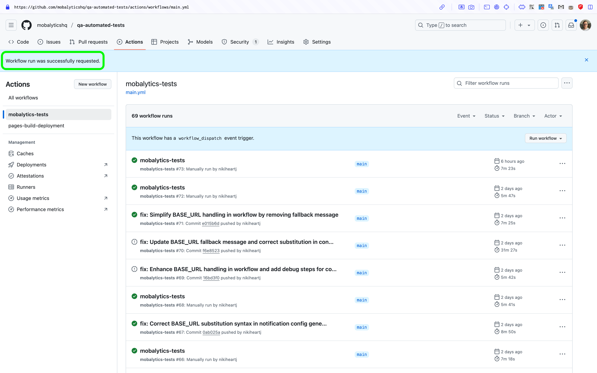
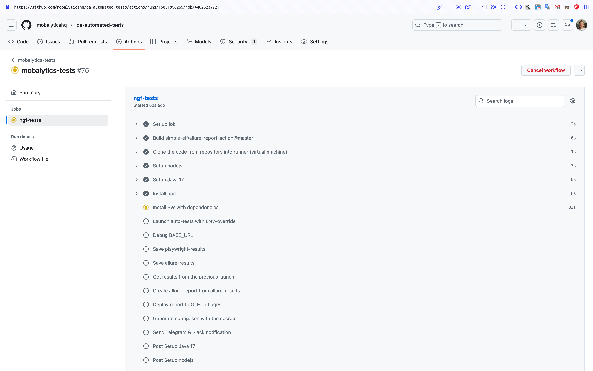
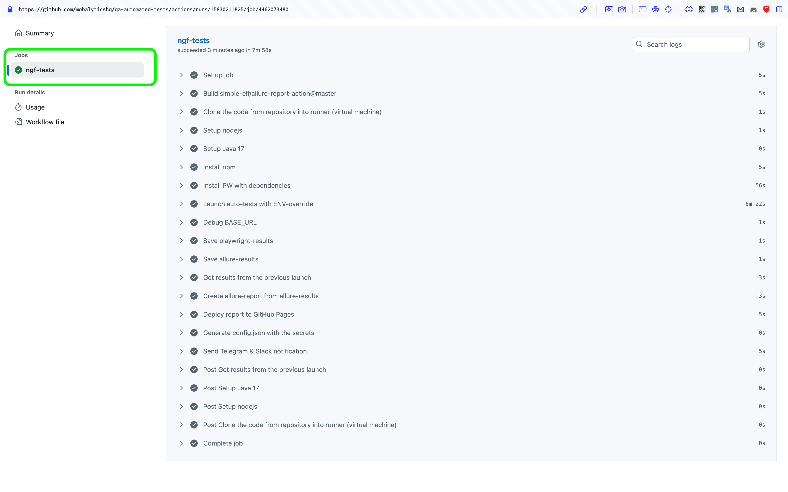
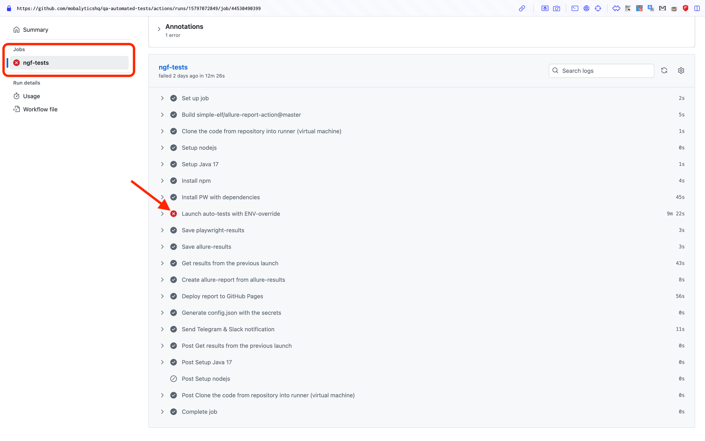
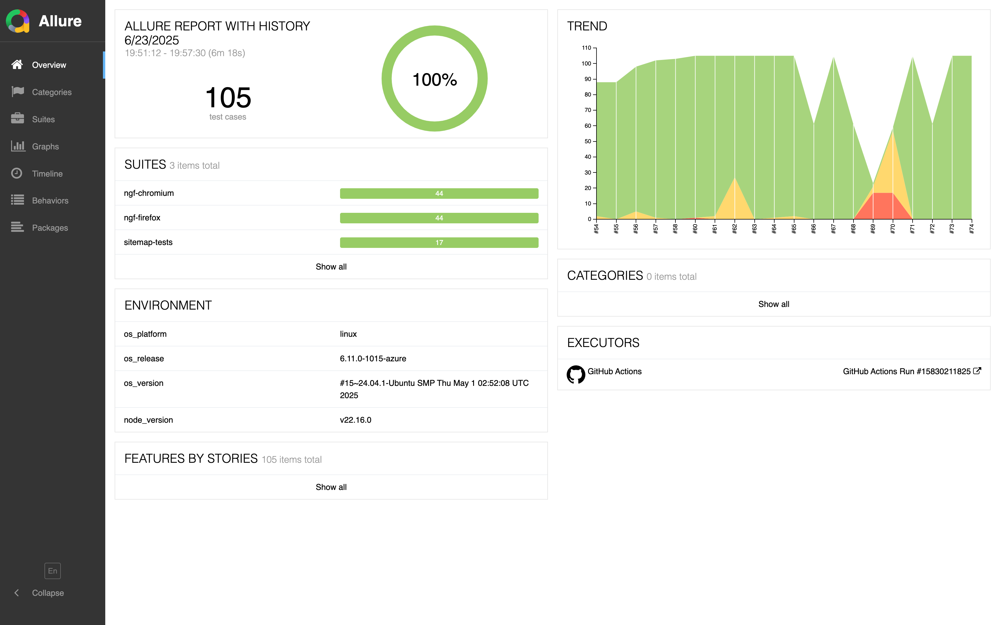

# Instructions on How to Launch Automated Tests

## Introduction

Hey, folks! There are 2 ways to launch tests:

- Using GitHub Actions (CI/CD)
- On your local machine (your PC)

### Steps to Run Tests Using GitHub Actions:

1. Go to the **Actions** tab (all workflows are located here).

2. Select the **mobalytics-tests** workflow.

3. Click the **Run workflow** button.

4. Enter the complete link to PROD or STG into the input field exactly as shown below:

   - `https://mobalytics.gg`
   - `https://stg.mobalytics.gg`

   Then click the green **Run workflow** button.

   > You will see a message indicating "Workflow run was successfully requested."
5. Refresh the page and navigate to the running workflow (a yellow circle indicates that the workflow is running).

6. Click on the running job: **ngf-tests**.

   > You will see each step of the running job is in progress.

Once the job has completed, you will receive one of two results:

- A green checkmark ✅ means all tests passed successfully.
- A red cross ❌ means some tests failed or are broken.

### Steps to Access the Allure Report:

1. Return to the **Actions** tab.
2. Wait until the **pages build and deployment** workflow is completed to generate the Allure Report (a yellow circle means the workflow is running). If the workflow is complete (green checkmark), proceed to the next step.
3. Select the most recently completed **pages build and deployment** workflow (usually the last workflow in the list).
4. Click the link in the **deploy** job.

   > Your Allure Report will open, displaying the results from the latest test run.
