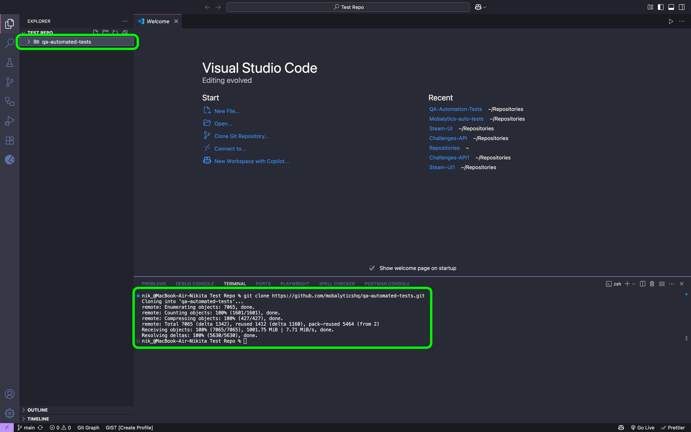
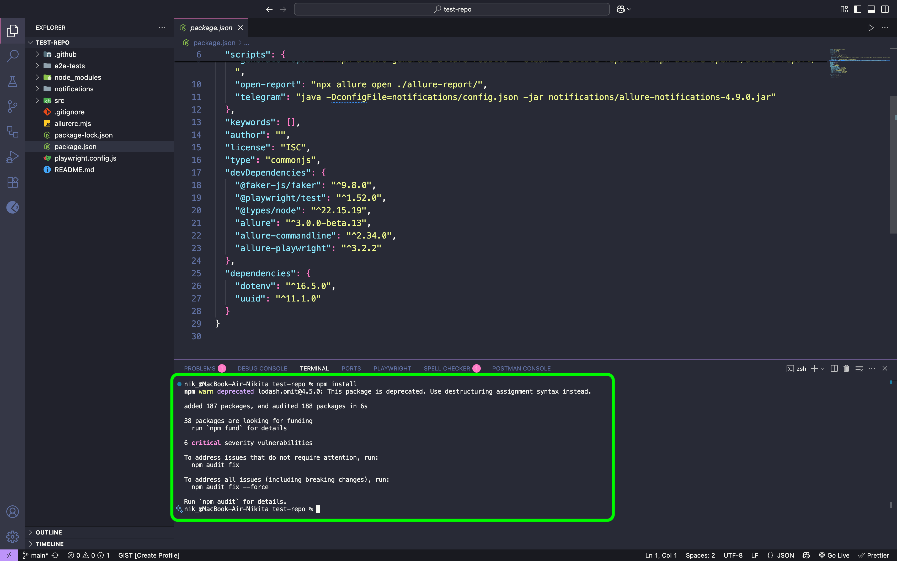
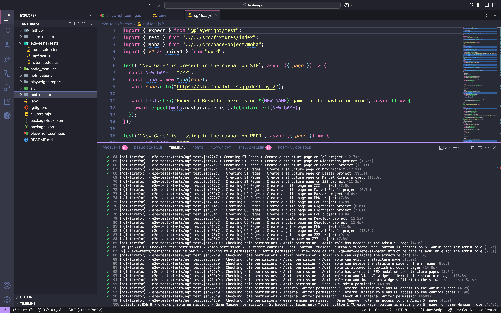
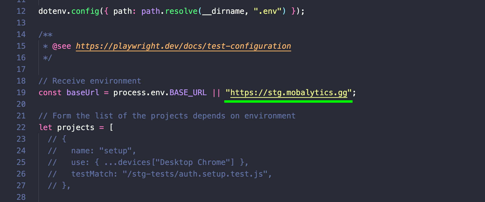
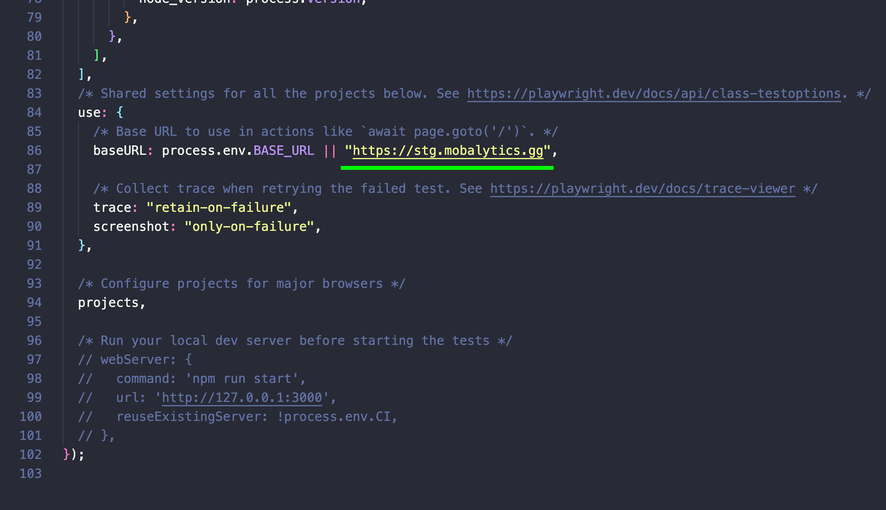

# Instructions on How to Launch Automated Tests

### Introduction

Hey, folks! There are two ways to launch tests:

- Using GitHub Actions (CI/CD)
- On your local machine (your PC)

## Steps to Run Tests Using GitHub Actions

1. Go to the **Actions** tab _(all workflows are located here)_.

2. Select the **mobalytics-tests** workflow from the Actions sidebar on the left side of the screen.

3. Click the **Run workflow** button.

4. Enter the complete link to PROD or STG into the input field exactly as shown below:

   - `https://mobalytics.gg`
   - `https://stg.mobalytics.gg`

   Then click the green **Run workflow** button.

   > You will see a message indicating "Workflow run was successfully requested."

   

5. Refresh the page and navigate to the running workflow _(a yellow circle indicates the workflow is running)_.

6. Click on the running job: **ngf-tests**.

   > You will see each step of the running job in progress.

   

Once the job is completed, you will receive one of two results:

- A green checkmark ✅ means all tests passed successfully.

  

- A red cross ❌ means some tests failed or are broken.

  

## Steps to Access the Allure Report

1. Return to the **Actions** tab.

2. Wait until the **pages build and deployment** workflow completes to generate the Allure Report _(a yellow circle means the workflow is running)_. If the workflow has completed _(green checkmark ✅)_, proceed to the next step.

3. Select the most recently completed **pages build and deployment** workflow _(usually the last workflow in the list)_.

4. Click the link in the **deploy** job.

   > Your Allure Report will open, displaying the results from the latest test run.

   

<br>
<br>
<br>

## Steps to Run Tests Using Your Local Machine

1. **Create a Folder**

   - Create a folder on your local machine where you will clone the repository. Then open this folder in your code editor.

2. **Clone the Repository**

   - Open the terminal and paste the following command, then press **Enter**:

   ```bash
   git clone https://github.com/mobalyticshq/qa-automated-tests.git
   ```

   > After the repository has been cloned successfully, you will see a new folder created and a **done** status message in the terminal process.

   

3. **Move Repository Content**

   - Open the cloned **qa-automated-tests** folder and move all files and folders from inside this folder to your root project folder. (In this example, the root folder is named **test-repo**.)

4. **Install Dependencies**

   - In the terminal, paste the following command and press **Enter**:

   ```bash
   npm install
   ```

   > After installing dependencies you will see such kind of messages in the terminal.

   

5. **Set Up the `.env` File**

   * Rename the file `.env.example` to `.env`, retrieve the correct credentials from the #team-qa Slack channel, and update your .env with those values.

6. **Run the Tests**

   * In the terminal, run tests using the following command:

   ```bash
   npm t
   ```

   > You will see the results of all executed tests displayed in the terminal.

   
   <br>
   <br>
   <br>

> NOTE: The **stg** environment is set by default. To change the environment, navigate to the root project & find **playwright.config.js** file then update the environment settings in two places:

   - `const baseUrl = process.env.BASE_URL || "https://stg.mobalytics.gg";`

   - `baseURL: process.env.BASE_URL || "https://stg.mobalytics.gg"`
